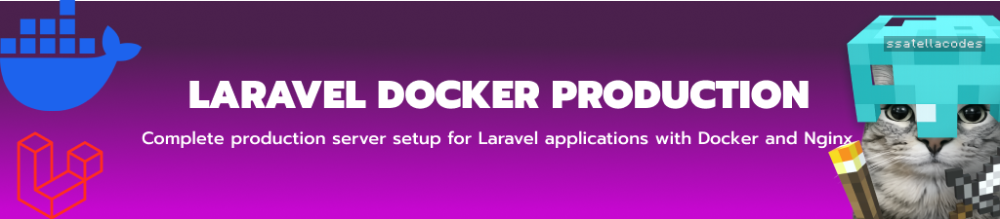
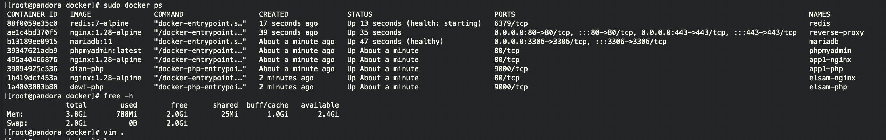
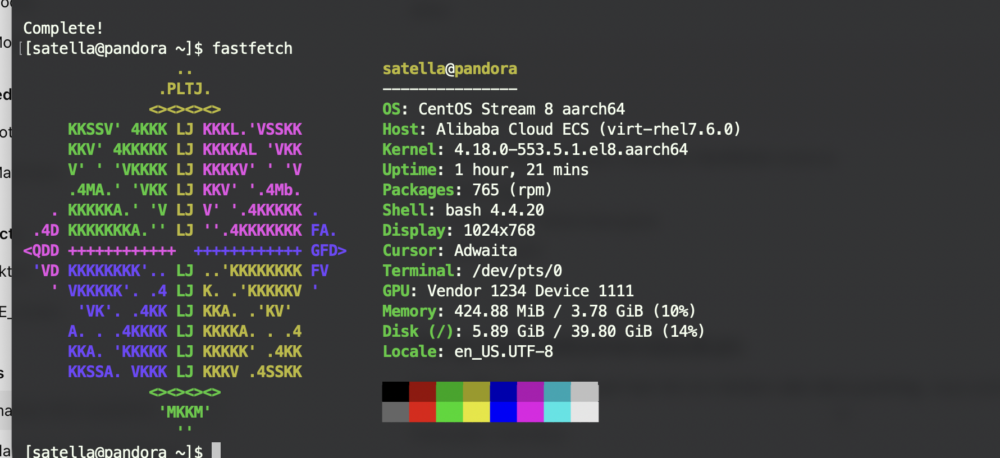

<div align="center">

  

  <br/>
  <br/>

  <p align="center">
    <a href="https://github.com/satellacodes/laravelDockerProduction"></a>
    <a href="https://github.com/satellacodes/laravelDockerProduction"></a>
    <a href="https://github.com/satellacodes/laravelDockerProduction"></a>
    
    
  </p>

  <p align="center">
    <a href="https://www.instagram.com/satellacodes/"></a>
    <a href="https://www.youtube.com/@satella.i"></a>
    <a href="https://dimasaris.xyz/"></a>
  </p>

</div>

# Laravel Docker Production

Production ready Laravel deployment using

- Docker Compose
- Nginx Reverse Proxy
- MariaDB
- Redis
- PHP-FPM
- SSL Let's Encrypt
- phpMyAdmin
- Multiple Applications

---

> [!NOTE]
> This is my first experience of a laravel production project on my VPS, I deployed 3 apps,
> if you find any bugs, or errors, just ask me, I am open to help you as much as I can

## Architecture

Internet
│
Cloudflare
│
Nginx
│
Laravel (PHP-FPM)
│
├── MariaDB
└── Redis

---

## Documentation

> [!NOTE]
> documentation is not finished yet, still in the creation stage

| Step                                                | Description          |
| --------------------------------------------------- | -------------------- |
| [01 Server Setup](docs/01-server.md)                | VPS preparation      |
| [02 Docker Installation](docs/02-install-docker.md) | Install Docker       |
| [03 Docker Network](docs/03-network.md)             | Network architecture |
| [04 Nginx](docs/04-nginx.md)                        | Reverse proxy        |
| [05 SSL](docs/05-ssl.md)                            | HTTPS                |
| [06 Laravel](docs/06-laravel.md)                    | Laravel deployment   |
| [07 Redis](docs/07-redis.md)                        | Cache & Queue        |
| [08 MariaDB](docs/08-mariadb.md)                    | Database             |
| [09 phpMyAdmin](docs/09-phpmyadmin.md)              | Database GUI         |
| [10 Deployment](docs/10-deployment.md)              | Deploy application   |
| [11 Backup](docs/11-backup.md)                      | Backup & Restore     |
| [12 Troubleshooting](docs/12-troubleshooting.md)    | Common Issues        |

---

## Repository Structure

```text
assets/
docs/
examples/
scripts/
```

---

## preview vps , docker ps and ram usage

  

- dian is app1
- dewi is app2
- phpmyadmin is app3, if not use it don't docker compose up

---

  

---

## Contributing

Contributions are welcome!

If you have suggestions, improvements, or bug fixes:

1. Fork repository
2. Create new branch
3. Commit changes
4. Open Pull Request

Please make sure your code follows the project style before submitting.

---

## Reporting Issues

Found a bug?

Please include:

- Operating System
- Docker Version
- Laravel Version
- Error Message
- Docker Logs
- Steps to Reproduce

Example

docker compose logs nginx

docker compose logs app

docker compose ps

---

## Security

Please do not open public issues for security vulnerabilities.

Instead, contact the maintainer privately with:

- vulnerability description
- reproduction
- affected version

---

## License

MIT
